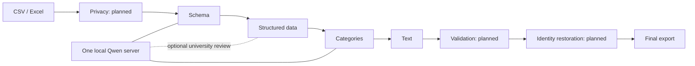

# Architecture and contracts

## One model, five roles

The team's roles are specializations of one locally served Qwen model. Python
loads a role from `prompts/`, supplies JSON data, validates the response, applies
changes with pandas, and writes files. There is no autonomous tool-calling loop
or separate model process per role.

This is the intended pipeline. Current commands run individual stages; `pipeline`
lists missing prerequisites and exits unsuccessfully. The leader's revised assignment
takes precedence over the earlier Colab diagram. Desktop execution is the current target.

## Responsibilities

| Component | Owns | Excludes |
| --- | --- | --- |
| Schema | Column context, semantic types, canonical names | Cell cleanup, merging people or form branches |
| Structured data | Local phone/email/ID/date/gender/attendance rules and university formatting | Skills, free-text rewriting, fuzzy auto-merging |
| Categories | Scalar aliases in a selected category | Splitting mixed answers, treating preferences as qualifications |
| Text | Explicit text columns, whitespace, placeholder flags | Translation, summarization, ranking |
| Validation | Future issue detection | Repairing values, deleting rows, rerunning stages |
| Python orchestration | Readiness, I/O, model boundary, ordering | Claiming missing stages ran |

Structured data uses tested Python rules and an optional UniversityJudgment response
for review proposals. The validation/integration owner coordinates contracts
with schema/text and implements the missing privacy and pipeline components.

## Current interfaces

- `run_schema(prepared, model=None)` builds bounded samples and returns a `StageResult`.
- `run_categories(prepared, column, category, model=None)` batches 20 distinct values
  and returns a result only after all batches validate.
- `run_text(dataframe, columns, enrich=False, mask_pii=False)` runs locally.
- `run_structured(data, column_roles=None, judge_universities=False, model=None)`
  accepts a dataframe for deterministic rules or PreparedData for optional model assistance.
- `run_structured_many(tables, ...)` shares observed university spellings across tables;
  no cross-file row merging occurs. Fuzzy/model equivalences are review-only.
- `LocalModel.analyze(role, payload, response_type)` sends the Markdown system prompt
  and JSON payload to localhost with a Pydantic-generated response schema.
- `read_table(path, sheet=0, header_row=1)` reads one selected table.
- `export_result(result, output, source=None)` writes separate stage-labeled files.

`PreparedData` contains `provenance`, `columns`, and rectangular `rows`. Provenance
must be `synthetic` or `manually_sanitized`: caller attestation, not proof of anonymity.

`StageResult` contains a copied dataframe, stage, changes, issues, and details.
The JSON report includes status and `pipeline_validated: false`. Successful stage
execution does not establish that the data is semantically correct.

Row and column references are zero-based source positions, independent of dataframe
labels. Raw-file metadata includes `first_data_row`; source Excel row number is
`first_data_row + row_index`. Prepared references identify the input `rows` array.
No implemented stage removes or reorders source rows.

## Applying decisions

Schema responses must cover every column index exactly once, preserve original
names, and produce unique output names. Empty columns retain their names. Confidence
below 0.70 retains the source name and produces a review issue.

Category responses must cover exactly the supplied values and preserve the requested
column/category. Values below 0.70 and `needs_review` results remain unchanged.
Common list separators are conservatively flagged rather than split; scalar labels
such as UI/UX therefore also require review in this version. Thresholds are heuristic.

Invalid JSON, incomplete generation, missing mappings, or name collisions stop the
stage before export. There are no automatic retries, guessed repairs, generated-code
execution, or model downloads on import. Large schemas may exceed model context;
increase the startup context or explicitly prepare a narrower table.

## Privacy and export limits

Automatic identity masking, vault management, and restoration remain unfinished.
Raw-file model commands stop before reading or transmitting the file. Do not relabel
private input as sanitized JSON. The model client accepts localhost HTTP only and
disables proxy environment settings and redirects.

Text masking is optional and incomplete. Original columns and change reports retain
values, so neither is anonymized. Missing flags do not establish question applicability.

CSV is read as text to preserve leading zeros and literal `NA`. Excel retains native
values; digits already lost to numeric storage cannot be reconstructed. Exports are
flat tables, not reconstructed workbooks: styling, formulas, macros, and unrelated
sheets are not preserved. XLSX strings are written literally. CSV strings are not
rewritten; spreadsheet applications may interpret formula-like CSV cells when opened.

See [dataset findings](data-notes.md) and [contribution guidance](../CONTRIBUTING.md).
